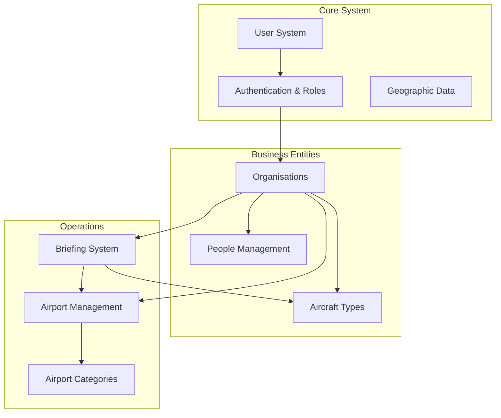
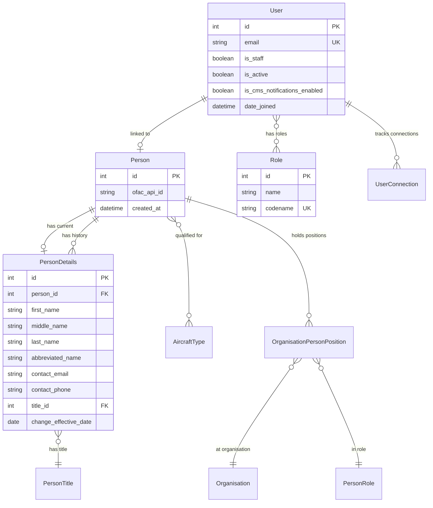
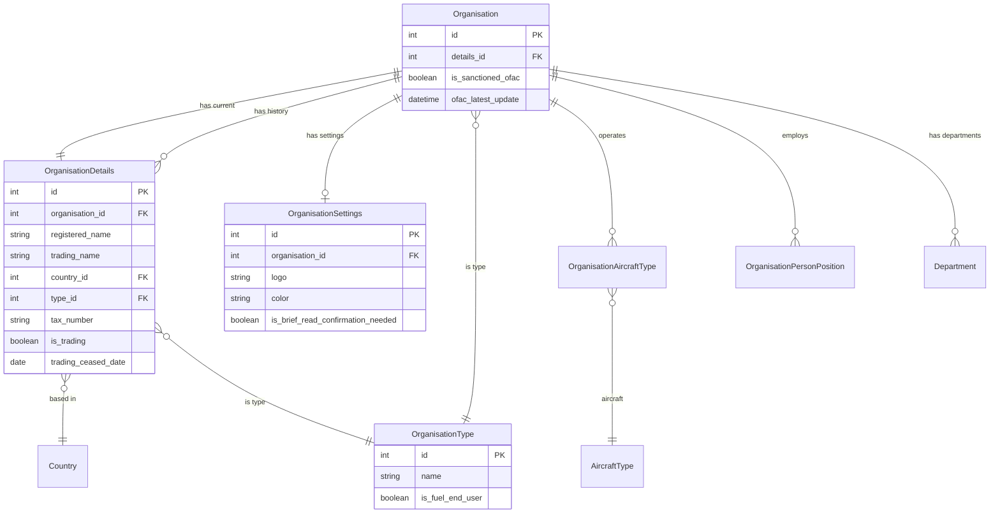
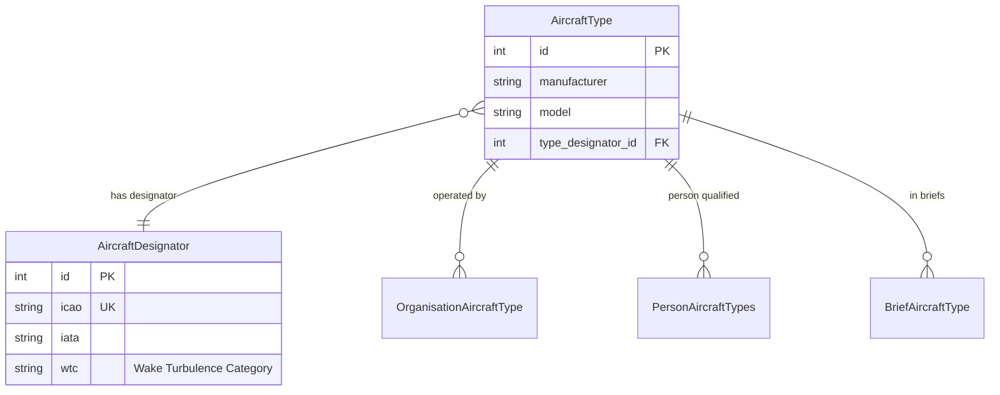
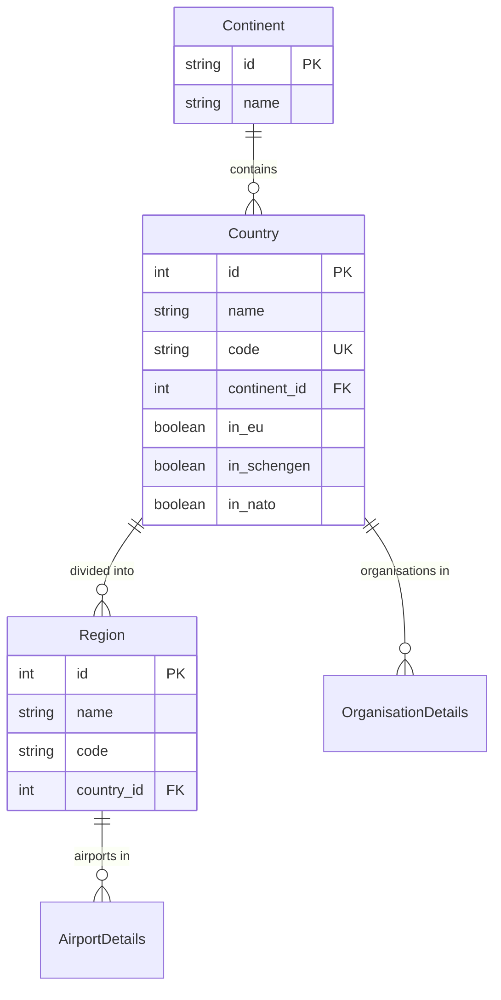
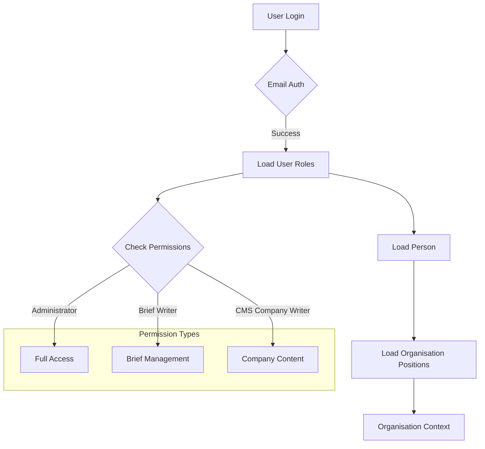
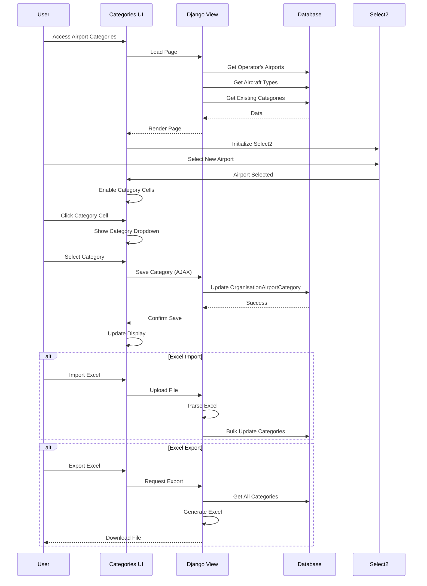
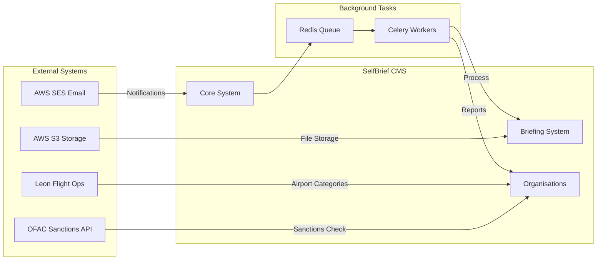

# SelfBrief CMS Complete Data Structure

## System Overview Architecture



## Core Models Entity Relationship Diagram



## Organisation Structure



## Airport Management System

```mermaid
erDiagram
    Organisation ||--o| AirportDetails : "is airport"
    AirportDetails ||--o{ AirportRunway : "has runways"
    AirportRunway }o--o{ AirportRunwayApproach : "has approaches"
    AirportRunway }o--o{ AirportRunwayLighting : "has lighting"
    AirportDetails }o--|| Region : "in region"
    AirportDetails }o--o{ AirportAtc : "has ATC"
    
    Organisation ||--o{ OrganisationAirportCategory : "assigns categories to"
    OrganisationAirportCategory }o--|| AirportCategory : "uses category"
    OrganisationAirportCategory }o--|| Organisation : "for airport"
    OrganisationAirportCategory }o--o| OrganisationAircraftType : "for aircraft type"
    
    AirportDetails {
        int id PK
        int organisation_id FK
        string icao_code UK
        string iata_code
        float latitude
        float longitude
        int elevation
        string timezone_name
        int maximum_weight
        string website_url
    }
    
    AirportCategory {
        int id PK
        string name "A, AA, A+, A2, B, BB, B+, B2, C, CC, C+, C2"
    }
    
    OrganisationAirportCategory {
        int id PK
        int organisation_id FK "Operator"
        int airport_id FK "Airport"
        int category_id FK
        int organisation_aircraft_type_id FK "NULL for All"
        unique(org_airport_aircraft)
    }
    
    AirportRunway {
        int id PK
        int airport_id FK
        string name
        float slope
        int length_m
        int width_m
        boolean is_active
    }
```

## Aircraft System



## Briefing System

```mermaid
erDiagram
    Brief }o--|| Organisation : "for operator"
    Brief }o--|| Organisation : "at airport"
    Brief ||--o{ BriefSection : "has sections"
    Brief ||--o{ BriefElement : "contains elements"
    Brief ||--o{ BriefRevision : "has revisions"
    Brief ||--o{ BriefAircraftType : "for aircraft"
    Brief ||--o{ BriefAmendmentRecord : "has amendments"
    
    BriefElement }o--|| BriefElementSection : "in section"
    BriefElement }o--|| BriefElementType : "is type"
    BriefElement ||--o{ BriefSubElement : "has sub-elements"
    BriefElement ||--o{ BriefElementAttachment : "has attachments"
    
    BriefRequest }o--|| Organisation : "for airport"
    BriefRequest }o--|| User : "requested by"
    BriefRequest ||--o{ BriefRequestAircraftType : "for aircraft"
    
    Brief {
        int id PK
        string name
        string description
        string document
        string video
        date content_date
        string brief_type "pdf, generated, video, manual"
        boolean is_blanket
        boolean is_draft
        date valid_from_date
        date valid_to_date
        int operator_id FK
        int airport_id FK
    }
    
    BriefElement {
        int id PK
        int brief_id FK
        int section_id FK
        int type_id FK
        int sequence
        string slug
        string label
        text text
        text rich_text
        boolean is_active
    }
    
    BriefRequest {
        int id PK
        int airport_id FK
        int requested_by_id FK
        date brief_date
        text comments
        boolean is_done
    }
```



## Geographic Data Structure



## User Authentication & Permissions Flow



## Data Flow for Airport Categories



## System Integration Points



## Database Schema Summary

### Table Prefixes
- **users_**: User authentication and connections
- **organisations_**: Organisation management
- **people_**: Person management
- **aircraft_**: Aircraft types and designators
- **briefs_**: Briefing documents and structure
- **core_**: System-wide entities (countries, regions)

### Key Relationships
1. **Multi-tenancy**: Organisations serve as the primary tenant boundary
2. **Polymorphic Relations**: Organisation can be Operator or Airport (type-based)
3. **Historical Tracking**: Details tables maintain change history
4. **Soft Deletes**: Trading ceased dates instead of deletion
5. **Audit Trail**: Created/Updated timestamps and user references

### Performance Considerations
- Indexed foreign keys for efficient joins
- Unique constraints on business keys
- Select_related and prefetch_related optimizations
- Custom managers for common queries
